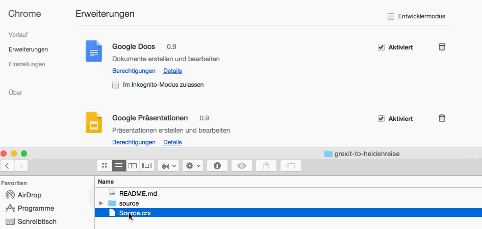

# Grexit-to-Heldenreise

### Irgendwie klingt Grexit zu hart. Darum habe ich eine Google Chrome Extension gebaut, die den Begriff Grexit durch Heldenreise ersetzt. Das klingt irgendwie freundlicher. 

#### Wie kann ich die Extension nutzen?

* __1. Schritt:__ Google Chrome öffnen und folgende URL eintippen __chrome://extensions/__.
* __2. Schritt:__ Ziehe nun die Source.crx in den Browser. 

* __3. Schritt:__ Nachrichtenartikel ausprobieren [bspw.](http://www.welt.de/debatte/kommentare/article143216346/Tsipras-hat-von-Anfang-an-den-Grexit-eingeplant.html)

